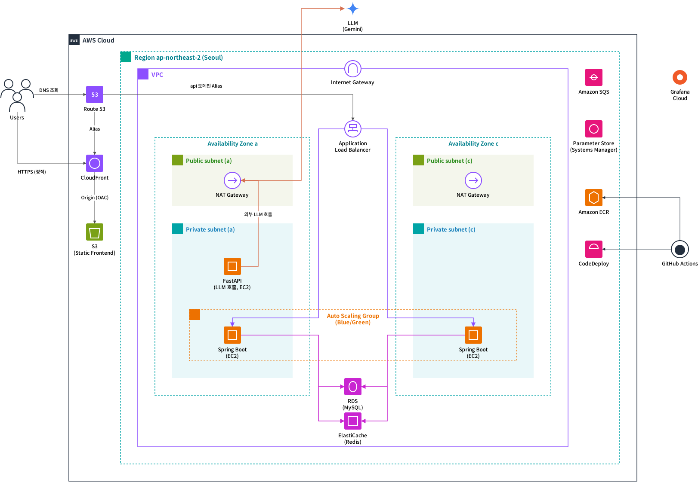
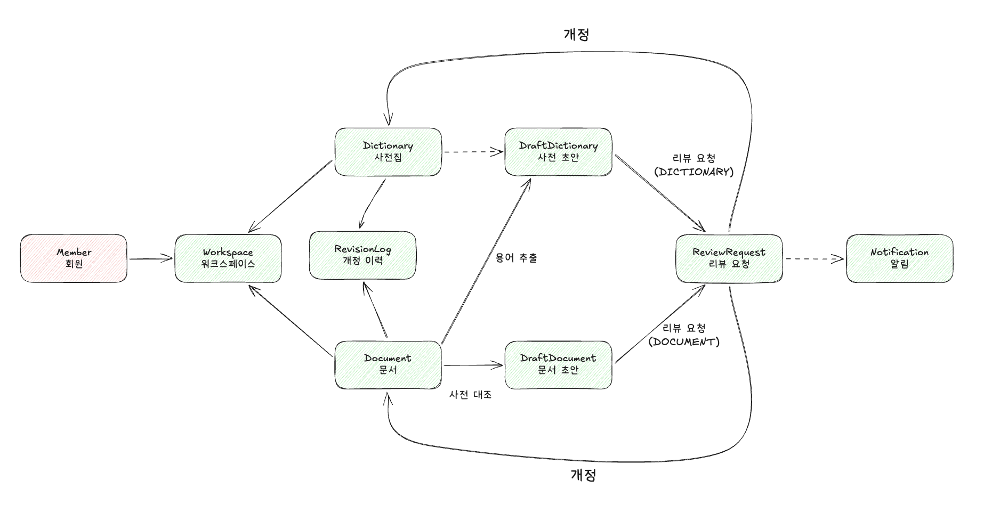

# Ubidict

팀 문서의 형상관리와 **유비쿼터스 언어(Ubiquitous Language) 정합성**을 맞춰 주는 협업 서비스입니다.

같은 개념을 사람마다, 문서마다 다른 말로 쓰기 시작하면 팀의 언어가 흩어집니다.
Ubidict는 팀이 쓴 문서에서 용어 사전을 만들고, 문서가 그 사전과 어긋나는 곳을 찾아 고칠 수 있게 돕습니다.

## 주요 기능

- **용어 사전 생성** — 워크스페이스의 문서를 LLM으로 분석해 유비쿼터스 용어 후보를 추출하고, 이전 사전집과 통합해 사전 초안을 만듭니다.
- **표현 정렬** — 같은 의미인데 문서마다 다르게 쓴 표현을 최신 사전집과 대조해 찾아내고, 사전 기준의 제안어로 교정 초안을 만듭니다.
- **리뷰와 버전 관리** — 사전 초안·문서 초안은 리뷰 요청을 거쳐 반영되고, 반영될 때마다 사전집·문서의 새 버전이 확정됩니다.
- **개정 이력과 알림** — 버전이 확정될 때 무엇이 바뀌었는지를 개정 이력으로 남기고, 리뷰 진행 상황을 알림으로 전달합니다.

## 아키텍처



- **프론트엔드** — React SPA를 S3에 올리고 CloudFront(OAC)로 서빙합니다. 도메인은 Route 53이 관리합니다.
- **API 서버** — Spring Boot가 ALB 뒤 Auto Scaling Group(Blue/Green, AZ 2개)에서 동작합니다. 데이터는 RDS(MySQL), 토큰·OAuth 상태는 ElastiCache(Redis)에 둡니다.
- **LLM 작업** — 용어 추출·문서 대조 요청은 transactional outbox를 거쳐 SQS로 발행되고([docs/OUTBOX.md](docs/OUTBOX.md)), FastAPI 워커가 받아 NAT Gateway를 통해 Gemini를 호출한 뒤 결과를 백엔드에 콜백합니다([docs/AI_CONTRACT.md](docs/AI_CONTRACT.md)).
- **운영** — 시크릿은 Parameter Store, 배포는 GitHub Actions → ECR · CodeDeploy, 관측(트레이스·메트릭·로그)은 OTLP로 Grafana Cloud에 보냅니다.

## 도메인



문서에서 **용어 추출**로 사전 초안을, **사전 대조**로 문서 초안을 만들고, 두 초안은 **리뷰 요청**을 거쳐 **개정**되어 사전집·문서의 새 버전이 됩니다.
버전이 확정될 때마다 개정 이력이 남고, 리뷰 이벤트는 알림으로 이어집니다. 엔티티와 정책은 [docs/DOMAIN.md](docs/DOMAIN.md)에 있습니다.

## 기술 스택

| 영역 | 기술 |
| --- | --- |
| Backend | Java 25, Spring Boot 4, Spring Data JPA, MySQL, Redis, Spring Security (JWT · Google OAuth2), Spring Cloud AWS (SQS · Parameter Store), OpenTelemetry |
| Frontend | React 19, TypeScript, Vite, TanStack Query, Zustand, Tailwind CSS 4 |
| AI 워커 | Python 3.11+, FastAPI, Google Gen AI SDK (Gemini), boto3 |
| Infra | AWS (Route 53, CloudFront, S3, ALB, EC2, RDS, ElastiCache, SQS, ECR, CodeDeploy), Docker Compose, GitHub Actions, Grafana |

## 저장소 구조

```
backend/                  Spring Boot API 서버
frontend/                 React SPA
ubidicExtractor/ubidict-py/  FastAPI LLM 워커
deploy/                   CodeDeploy 배포 스크립트
docs/                     요구사항 · 도메인 · 아키텍처 · 계약 문서
```

## 실행

```bash
# Backend — http://localhost:8080
# MySQL·Redis 등 의존 컨테이너는 spring-boot-docker-compose 가 backend/compose.yaml 로 자동으로 띄운다
cd backend
./gradlew bootRun --args='--spring.profiles.active=local'

# Frontend — http://localhost:5173
cd frontend
npm install
npm run dev
```

프로파일·환경변수 같은 자세한 설정은 [CLAUDE.md](CLAUDE.md)와 [backend/CLAUDE.md](backend/CLAUDE.md)를 참고하세요.

## 문서

- [docs/REQUIREMENTS.md](docs/REQUIREMENTS.md) — 요구사항
- [docs/DOMAIN.md](docs/DOMAIN.md) — 엔티티, 관계, 정책
- [docs/ARCHITECTURE.md](docs/ARCHITECTURE.md) — 패키지 구조와 레이어 규칙
- [docs/AI_CONTRACT.md](docs/AI_CONTRACT.md) — 백엔드 ↔ AI 워커 계약
- [docs/OUTBOX.md](docs/OUTBOX.md) — LLM 작업 발행의 transactional outbox
